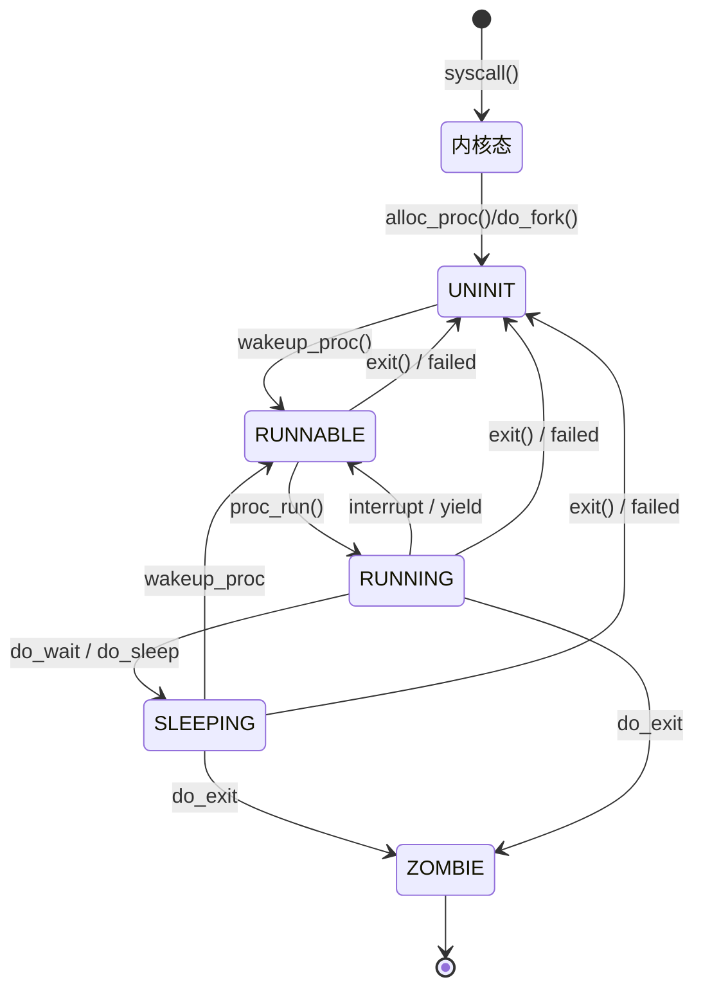

#                                  lab5  实验报告

## 一、实验内容

- 了解第一个用户进程创建过程
- 了解系统调用框架的实现机制
- 了解ucore如何实现系统调用sys_fork/sys_exec/sys_exit/sys_wait来进行进程管理


实验4完成了内核线程，但到目前为止，所有的运行都在内核态执行。实验5将创建用户进程，让用户进程在用户态执行，且在需要ucore支持时，可通过系统调用来让ucore提供服务。为此需要构造出第一个用户进程，并通过系统调用`sys_fork`/ sys_exec /sys_exit /sys_wait 来支持运行不同的应用程序，完成对用户进程的执行过程的基本管理。

本实验中第一个用户进程是由第二个内核线程initproc通过把hello应用程序执行码覆盖到initproc的用户虚拟内存空间来创建的


## 二、实验过程

###  练习0：填写已有实验

本实验依赖实验1/2/3/4。请把你做的实验1/2/3/4的代码填入本实验中代码中有“LAB1”/“LAB2”/“LAB3”/“LAB4”的注释相应部分。注意：为了能够正确执行lab5的测试应用程序，可能需对已完成的实验1/2/3/4的代码进行进一步改进。

#### 1.合并并修改代码1——alloc_proc函数

```c++
// alloc_proc - alloc a proc_struct and init all fields of proc_struct
static struct proc_struct *
alloc_proc(void)
{
    struct proc_struct *proc = kmalloc(sizeof(struct proc_struct));
    if (proc != NULL)
    {
        proc->state = PROC_UNINIT; // 设置进程为初始态
        proc->pid = -1;            // 设置进程pid的未初始化值
        proc->runs = 0;
        proc->kstack = 0;
        proc->need_resched = 0;
        proc->parent = NULL;
        proc->mm = NULL;
        memset(&(proc->context), 0, sizeof(struct context));
        proc->tf = NULL;
        proc->cr3 = boot_cr3; // 使用内核页目录表的基址
        proc->flags = 0;
        memset(proc->name, 0, PROC_NAME_LEN);
        // 新增
        proc->wait_state = 0;                        // PCB新增的条目，初始化进程等待状态
        proc->cptr = proc->yptr = proc->optr = NULL; // 设置指针为空
        //对进程控制块中新增的条目的初始化：proc->wait_state = 0：初始化进程等待状态，这是新增的进程控制块中的条目。proc->cptr = proc->yptr = proc->optr = NULL：将进程的指向子进程、同级进程、父进程的指针都设置为 NULL，即当前进程暂时没有子进程、同级进程和父进程。
    }
    return proc;
}
```

改进的内容为：

```c++
proc->wait_state = 0; //初始化进程等待状态
proc->cptr = proc->optr = proc->yptr = NULL; //指针初始化
```
对进程控制块中新增的条目的初始化：proc->wait_state = 0：初始化进程等待状态，这是新增的进程控制块中的条目。proc->cptr = proc->yptr = proc->optr = NULL：将进程的指向子进程、同级进程、父进程的指针都设置为 NULL，即当前进程暂时没有子进程、同级进程和父进程。


#### 2.合并并修改代码2——do_fork函数

```c++
int do_fork(uint32_t clone_flags, uintptr_t stack, struct trapframe *tf)
{
    int ret = -E_NO_FREE_PROC;
    struct proc_struct *proc;
    if (nr_process >= MAX_PROCESS)
    {
        goto fork_out;
    }
    ret = -E_NO_MEM;
    proc = alloc_proc(); // 本质上是用kmlloc函数分配了一块内存空间，然后将proc指向这块内存空间
    if (proc == NULL)
    {
        goto fork_out;
    }
    proc->parent = current;           // 将子进程的父进程设置为当前进程，后面用这个当前进程控制子进程的资源释放
    assert(current->wait_state == 0); // 确保进程在等待（确保当前进程的wait_state为0）
    ret = setup_kstack(proc);
    if (ret != 0)
    {
        goto bad_fork_cleanup_proc;
    }
    ret = copy_mm(clone_flags, proc); // 根据clone_flags决定是复制还是共享内存管理系统
    if (ret != 0)
    {
        goto bad_fork_cleanup_kstack;
    }
    copy_thread(proc, stack, tf);
    bool intr_flag;
    local_intr_save(intr_flag);
    {
        proc->pid = get_pid(); // 分配一个新的不重复的pid

        // list_add(&proc_list, &(proc->list_link));
        // nr_process++;
        // 将proc_struct插入到hash_list和proc_list中（上面已做），设置进程的关系链接
        set_links(proc); // 设置进程链接
        hash_proc(proc); // 将进程插入到hash_list中
    }
    local_intr_restore(intr_flag);
    wakeup_proc(proc); // 设置proc的state为PROC_RUNNABLE，使得进程可以被调度执行
    ret = proc->pid;

fork_out:
    return ret;

bad_fork_cleanup_kstack:
    put_kstack(proc);
bad_fork_cleanup_proc:
    kfree(proc);
    goto fork_out;
}
```

改进内容为：

```c++
assert(current->wait_state == 0); //确保进程在等待
set_links(proc); //设置进程链接
```
第一行代码使用了assert语句来确保当前进程的wait_state为0，即当前进程正在等待。assert语句用于在运行时检查一个表达式是否为真，如果为假，则触发断言失败，终止程序执行。

在这里，assert(current->wait_state == 0);的作用是检查当前进程的wait_state是否为0。如果不为0，assert将触发断言失败，导致程序中止。这样的设计有助于在开发和调试阶段捕获潜在的错误，确保进程处于正确的等待状态。

第二行代码是一个调用set_links(proc)，它的作用是设置进程的链接。由于没有提供set_links函数的具体实现，我假设它负责在进程控制块中设置指向子进程、同级进程和父进程的指针等链接关系。

总的来说，这两行代码的目的是确保在使用alloc_proc函数分配并初始化进程控制块时，当前进程的等待状态正确，并在必要时设置相应的链接关系。

#### 3.合并并修改代码3——proc_run、do_pgfault函数

直接填入lab4代码，不需要修改

#### 4.其他已经修改好的部分解释——interrupt_handler函数

```c++
void interrupt_handler(struct trapframe *tf)
{
    intptr_t cause = (tf->cause << 1) >> 1;
    switch (cause)
    {
    // ......代码省略
    case IRQ_S_TIMER:
        
        clock_set_next_event();
        if (++ticks % TICK_NUM == 0 && current)
        {
            // print_ticks();
            current->need_resched = 1;
        }
        break;
    // ......代码省略
    default:
        print_trapframe(tf);
        break;
    }
}
```

改动：

- 不输出“100ticks"
- 每100次时间中断后，当前正在执行的进程准备被调度，用于用户态线程切换
- 
练习1: 加载应用程序并执行（需要编码）

**do_execv**函数调用`load_icode`（位于kern/process/proc.c中）来加载并解析一个处于内存中的ELF执行文件格式的应用程序。你需要补充`load_icode`的第6步，建立相应的用户内存空间来放置应用程序的代码段、数据段等，且要设置好`proc_struct`结构中的成员变量trapframe中的内容，确保在执行此进程后，能够从应用程序设定的起始执行地址开始执行。需设置正确的trapframe内容。

请在实验报告中简要说明你的设计实现过程。

- 请简要描述这个用户态进程被ucore选择占用CPU执行（RUNNING态）到具体执行应用程序第一条指令的整个经过。


#### 1、编码思路

接着lab4的实验，本实验在init进程初始化并占用CPU之后，借由init进程fork用户进程，函数执行流为

`user_main`----->`kernel_execve`----->`sys_exec`----->`do_execve`----->`load_icode`

`user_main`函数：

```c++
user_main(void *arg)
{
#ifdef TEST
    KERNEL_EXECVE2(TEST, TESTSTART, TESTSIZE);
#else
    KERNEL_EXECVE(exit);
#endif
    panic("user_main execve failed.\n");
}
```

在`make grade`中指定了`TEST`，将会执行`forktest`用户进程，随后进入相应的宏定义

```c++
#define __KERNEL_EXECVE(name, binary, size) ({           \
    cprintf("kernel_execve: pid = %d, name = \"%s\".\n", \
            current->pid, name);                         \
    kernel_execve(name, binary, (size_t)(size));         \
})
```

进而进入`kernel_execve`函数，其中的内联汇编部分将会触发系统调用，随后调用函数`sys_exec`，进而调用函数`do_execve`

```c++
static int
sys_exec(uint64_t arg[])
{
    const char *name = (const char *)arg[0];
    size_t len = (size_t)arg[1];
    unsigned char *binary = (unsigned char *)arg[2];
    size_t size = (size_t)arg[3];
    return do_execve(name, len, binary, size);
}
```

`do_execve`这个函数负责为一个新的用户程序创建并配置内存管理结构、页目录表，并设置程序的初始执行环境，包括用户栈和中断帧。

```c++
int do_execve(const char *name, size_t len, unsigned char *binary, size_t size)
{
    struct mm_struct *mm = current->mm;
    if (!user_mem_check(mm, (uintptr_t)name, len, 0)) 
    {
        return -E_INVAL;
    }
    if (len > PROC_NAME_LEN)
    {
        len = PROC_NAME_LEN;
    }
    char local_name[PROC_NAME_LEN + 1];
    memset(local_name, 0, sizeof(local_name));
    memcpy(local_name, name, len);
    if (mm != NULL)
    {
        cputs("mm != NULL");
        lcr3(boot_cr3);
        if (mm_count_dec(mm) == 0) 
        {
            exit_mmap(mm);  
            put_pgdir(mm);  
            mm_destroy(mm); 
        }
        current->mm = NULL;
    }
    int ret;
    if ((ret = load_icode(binary, size)) != 0)
    {
        goto execve_exit;
    }
    set_proc_name(current, local_name);
    return 0;
execve_exit:
    do_exit(ret);
    panic("already exit: %e.\n", ret);
}
```

load_icode函数的主要目的是将一个ELF执行文件加载到内存中，并为用户进程创建相应的内存结构和环境，以便在操作系统中运行。下面是对每个功能的详细解释：
1.为用户进程创建新的mm结构： 在Linux内核中，mm结构表示一个进程的内存空间。load_icode函数负责为即将执行的用户进程创建一个新的mm结构，以便管理其内存空间。
2.创建页目录表： 页目录表是x86架构中用于管理虚拟地址空间的数据结构。load_icode函数负责为用户进程创建一个新的页目录表，用于映射虚拟地址到物理地址。
3.校验ELF文件的魔数是否正确： ELF是一种常见的可执行文件格式。在加载之前，需要确保文件的魔数正确，以验证它是否是有效的ELF文件。
4.创建虚拟内存空间： 虚拟内存空间由一系列VMA结构表示，每个VMA表示一个连续的虚拟地址范围。load_icode函数负责为用户进程的mm结构添加适当的VMA，以便将代码段、数据段等映射到合适的虚拟地址。
5.分配内存，并拷贝ELF文件的各个program section到新申请的内存上： 根据ELF文件的段信息，load_icode函数负责为每个段分配内存，并将段的内容从文件中拷贝到相应的内存位置。
6.为BSS section分配内存，并初始化为全0： BSS段通常包含未初始化的全局变量，其内容在程序加载时需要初始化为零。load_icode函数负责为BSS段分配内存，并将其初始化为全0。
7.分配用户栈内存空间： 用户进程需要一个用于执行函数调用和保存局部变量的栈空间。load_icode函数负责为用户进程分配适当大小的栈空间。
8.设置当前用户进程的mm结构、页目录表的地址及加载页目录表地址到cr3寄存器： 将创建的mm结构和页目录表与当前用户进程关联，并将页目录表的物理地址加载到CR3寄存器，以启用分页机制。
9.设置当前用户进程的tf结构： 在用户进程切换时，需要保存和恢复寄存器状态。load_icode函数负责设置用户进程的任务帧，其中包括程序计数器、栈指针等寄存器的初始状态。
总体而言，load_icode函数在用户进程加载过程中扮演着关键的角色，确保程序的代码和数据正确地映射到内存中，为用户进程的正确执行提供必要的环境。
```c++
static int
load_icode(unsigned char *binary, size_t size)
{
    if (current->mm != NULL)
    {
        panic("load_icode: current->mm must be empty.\n");
    }
    int ret = -E_NO_MEM;
    struct mm_struct *mm;
    if ((mm = mm_create()) == NULL)
    {
        goto bad_mm;
    }
    if (setup_pgdir(mm) != 0) // 其实就是alloc一页然后将页目录表的基址赋值给mm->pgdir
    {
        goto bad_pgdir_cleanup_mm;
    }
    struct Page *page;
    vm_flags = VM_READ | VM_WRITE | VM_STACK;
    if ((ret = mm_map(mm, USTACKTOP - USTACKSIZE, USTACKSIZE, vm_flags, NULL)) != 0)
    {
        goto bad_cleanup_mmap;
    }
    assert(pgdir_alloc_page(mm->pgdir, USTACKTOP - PGSIZE, PTE_USER) != NULL);
    assert(pgdir_alloc_page(mm->pgdir, USTACKTOP - 2 * PGSIZE, PTE_USER) != NULL);
    assert(pgdir_alloc_page(mm->pgdir, USTACKTOP - 3 * PGSIZE, PTE_USER) != NULL);
    assert(pgdir_alloc_page(mm->pgdir, USTACKTOP - 4 * PGSIZE, PTE_USER) != NULL);
    mm_count_inc(mm);
    current->mm = mm;
    current->cr3 = PADDR(mm->pgdir);
    lcr3(PADDR(mm->pgdir));
    struct trapframe *tf = current->tf;
    uintptr_t sstatus = tf->status;
    memset(tf, 0, sizeof(struct trapframe));
    tf->gpr.sp = USTACKTOP;
    tf->epc = elf->e_entry;
    tf->status = (read_csr(sstatus) | SSTATUS_SPIE) & ~SSTATUS_SPP;
    ret = 0;
out:
    return ret;
bad_cleanup_mmap:
    exit_mmap(mm);
bad_elf_cleanup_pgdir:
    put_pgdir(mm);
bad_pgdir_cleanup_mm:
    mm_destroy(mm);
bad_mm:
    goto out;
}
```

需要我们补充的部分为第六部分—— 设置用户程序的入口地址、用户栈指针和状态寄存器等信息

```c++
struct trapframe *tf = current->tf;
tf->gpr.sp = USTACKTOP;
tf->epc = elf->e_entry;
tf->status = (read_csr(sstatus) | SSTATUS_SPIE ) & ~SSTATUS_SPP;
```

- `tf->gpr.sp` ：设置用户栈指针为用户栈的顶部。
- `tf->epc` ：设置用户程序的入口地址。
- `tf->status` ：设置状态寄存器，确保用户程序在用户态运行，并开启中断


#### 2、简述经过

1.进程创建和等待：

Initproc 和 Userproc： 内核线程 initproc 创建用户态进程 userproc。
等待子进程： initproc 调用 do_wait 函数等待子进程的出现。

2.进程调度和运行：

启动新线程： schedule 函数在确认存在 RUNNABLE 子进程后被激活。
proc_run 功能： 通过 proc_run 运行新线程，包括设置栈指针、重新加载页目录表、切换到用户态，并跳至 forkret 函数。

3.进程切换和系统调用处理：

处理 forkrets 和 __trapret： forkret 调用 forkrets 函数，最终跳到 __trapret。
kernel_thread_entry 的任务： 在 __trapret 中，跳转到 kernel_thread_entry，该函数负责将控制权传递给 user_main 函数。
执行 user_main 和 kernel_execve： user_main 执行一些任务，然后调用 kernel_execve 执行 exec 系统调用。

4.应用程序加载和执行：

do_execve 函数： 在系统调用处理中，do_execve 负责处理 execve 系统调用。
内存空间处理： do_execve 检查并释放虚拟内存空间，加载应用程序的代码和数据段。
加载应用程序： 使用 load_icode 加载应用程序，创建新的内存管理结构，分配内存并初始化 BSS 段。
设置进程状态： 加载页目录表到 cr3 寄存器，设置用户进程的 tf 结构。

5.从内核态到用户态的转换：

__trapret 的角色： 在应用程序加载完成后，控制流返回到 __trapret 函数。
寄存器状态维护： __trapret 函数维持寄存器状态，实现从内核态到用户态的平滑过渡


## 练习2: 父进程复制自己的内存空间给子进程（需要编码）

创建子进程的函数`do_fork`在执行中将拷贝当前进程（即父进程）的用户内存地址空间中的合法内容到新进程中（子进程），完成内存资源的复制。具体是通过`copy_range`函数（位于kern/mm/pmm.c中）实现的，请补充`copy_range`的实现，确保能够正确执行。

请在实验报告中简要说明你的设计实现过程。

- 如何设计实现`Copy on Write`机制？给出概要设计，鼓励给出详细设计。

> Copy-on-write（简称COW）的基本概念是指如果有多个使用者对一个资源A（比如内存块）进行读操作，则每个使用者只需获得一个指向同一个资源A的指针，就可以该资源了。若某使用者需要对这个资源A进行写操作，系统会对该资源进行拷贝操作，从而使得该“写操作”使用者获得一个该资源A的“私有”拷贝—资源B，可对资源B进行写操作。该“写操作”使用者对资源B的改变对于其他的使用者而言是不可见的，因为其他使用者看到的还是资源A。


#### 1、编码思路

函数调用过程如下

```c++
do_fork()---->copy_mm()---->dup_mmap()---->copy_range()
```

`do_fork`函数用于为一个新的子进程创建父进程

其执行流如下：

1.检查当前进程数量： 首先，检查当前系统中的进程数量是否已经达到最大值（MAX_PROCESS）。如果达到最大值，则返回错误码 -E_NO_FREE_PROC 并跳转到 fork_out 处，执行清理操作。
2.分配新的进程结构： 调用 alloc_proc 函数分配一个新的进程结构（proc_struct）。如果分配失败，也就是返回的进程结构指针为 NULL，则跳转到 fork_out 进行清理。
3.设置新进程的父进程和等待状态： 将新进程的父进程指定为当前进程，同时确保当前进程的 wait_state 设置为 0。
4.为新进程分配内核栈： 调用 setup_kstack 函数为新进程分配一个内核栈。如果内核栈分配失败，会跳转到 bad_fork_cleanup_proc 进行清理。
5.复制或共享内存管理结构： 调用 copy_mm 函数，根据传入的 clone_flags 参数，选择性地复制或共享父进程的内存管理结构。如果复制失败，会跳转到 bad_fork_cleanup_kstack 进行清理。在这个过程中，copy_mm 函数调用了 dup_mmap 函数，而 dup_mmap 又调用了 copy_range 函数。
6.设置新进程的陷阱帧和上下文： 调用 copy_thread 函数设置新进程的陷阱帧和上下文，以确保新进程能够正确运行。
7.分配新的进程ID： 分配一个新的、不重复的进程ID（pid），并将新进程插入到进程哈希列表和进程列表中。
8.唤醒新进程： 调用 wakeup_proc 函数将新进程的状态设置为可运行（PROC_RUNNABLE），表示新进程可以被调度执行。
9.设置返回值： 将返回值设置为新进程的进程ID（pid）。

在调用`copy_mm`函数的时候进一步调用了`dup_mmap`函数，其内调用了`copy_range`函数

其实`copy_range`函数就是调用一个memcpy将父进程的内存直接复制给子进程

```c++
int copy_range(pde_t *to, pde_t *from, uintptr_t start, uintptr_t end, bool share)
{
    assert(start % PGSIZE == 0 && end % PGSIZE == 0);
    assert(USER_ACCESS(start, end));
    do
    {
        pte_t *ptep = get_pte(from, start, 0), *nptep;
        if (ptep == NULL)
        {
            start = ROUNDDOWN(start + PTSIZE, PTSIZE);
            continue;
        }
        if (*ptep & PTE_V)
        {
            if ((nptep = get_pte(to, start, 1)) == NULL)
            {
                return -E_NO_MEM;
            }
            uint32_t perm = (*ptep & PTE_USER);
            struct Page *page = pte2page(*ptep);
            struct Page *npage = alloc_page();
            assert(page != NULL);
            assert(npage != NULL);
            int ret = 0;
            void *kva_src = page2kva(page);
            void *kva_dst = page2kva(npage);
            memcpy(kva_dst, kva_src, PGSIZE);
            ret = page_insert(to, npage, start, perm);
            assert(ret == 0);
        }
        start += PGSIZE;
    } while (start != 0 && start < end);
    return 0;
}
```

具体实现就是：
assert(start % PGSIZE == 0 && end % PGSIZE == 0); 和 assert(USER_ACCESS(start, end)); 用于确保 start 和 end 是页面对齐的地址，并且是合法用户空间地址范围。
函数通过一个 do-while 循环来遍历 start 到 end 范围内的页表项。
在循环中，通过 get_pte 函数获取 from 地址空间中的页表项指针 ptep，如果为 NULL，则跳过当前页表项所在的页面，进入下一个页面。
如果页表项有效（PTE_V 标志有效），则从 from 地址空间中获取页表项对应的物理页，然后在 to 地址空间中为该页分配一个新的物理页。
接着，使用 memcpy 函数将源物理页的内容复制到目标物理页中，并使用 page_insert 函数将目标物理页映射到 to 地址空间的对应虚拟地址上。
循环结束条件是 start 不为 0 并且小于 end。
最后返回 0，表示复制操作成功完成。


#### 2、简述Copy on Write机制

Copy on Write核心思想是在资源真正需要修改之前，不复制资源。所以设计的时候从以下方面进行

1. 当多个进程需要读取同一个资源（如内存页）时，它们初始时共享同一份资源的拷贝，而不是各自持有独立的副本。
2. 只有当其中一个进程尝试修改这个共享资源时，系统才会创建一个新的资源副本。

设计思路：

1.设置共享内存标记：
引入一个标记位（例如 share），用于标识某块内存是否为共享。初始时，这个标记被设置为 1，表示内存是可以被多个进程共享的。
2.处理共享页面的复制：
在处理内存映射的过程中，特别是在 dup_mmap 函数中，检查共享标记。如果 share 为 1，表示页面是共享的。
在物理内存管理模块（如 pmm.c）的 copy_range 函数中，对共享页面进行特殊处理。子进程的页面不独立复制，而是直接映射到父进程相同的物理页面。
为了防止写操作对其他进程产生影响，将这些共享页面的权限设置为只读。
3.页面错误处理：
当任一进程尝试对只读的共享页面进行写操作时，触发页面错误（Page Fault）。
页面错误处理机制识别这种情况，采取特定措施，为执行写操作的进程分配一个新的物理页面。
将原共享页面的内容复制到新分配的页面中，并更新引起页面错误的进程的内存映射，使其指向新的物理页面。


## 练习3: 阅读分析源代码，理解进程执行 fork/exec/wait/exit 的实现，以及系统调用的实现（不需要编码）

请在实验报告中简要说明你对 fork/exec/wait/exit函数的分析。并回答如下问题：

- 请分析fork/exec/wait/exit的执行流程。重点关注哪些操作是在用户态完成，哪些是在内核态完成？内核态与用户态程序是如何交错执行的？内核态执行结果是如何返回给用户程序的？
- 请给出ucore中一个用户态进程的执行状态生命周期图（包执行状态，执行状态之间的变换关系，以及产生变换的事件或函数调用）。（字符方式画即可）

执行：make grade。如果所显示的应用程序检测都输出ok，则基本正确。（使用的是qemu-1.0.1）


#### 1、fork函数

执行流程：

```c++
fork->SYS_fork->do_fork+wakeup_proc->syscall(SYS_fork)->ecall
```

在用户态：
父进程调用fork函数，该函数是一个标准的C库函数。fork函数并不是直接执行系统调用，而是通过软中断（通常是int 0x80）切换到内核态。
在内核态：
系统调用fork会触发内核态中的SYS_fork，这是由内核提供的处理fork系统调用的具体实现。
在SYS_fork中，实际的工作由do_fork函数完成。do_fork的主要任务是复制父进程的资源，包括内存映射、文件描述符等。它还创建一个新的proc_struct结构表示子进程，并为子进程分配一个独立的内核栈。
do_fork完成后，调用wakeup_proc将子进程标记为可执行状态，并将其加入调度队列。父进程和子进程都处于可执行状态，但调度器决定哪个进程运行。
返回到用户态：
do_fork执行完成后，SYS_fork系统调用返回到用户态。在用户态，fork函数返回两次，一次在父进程中，返回子进程的PID；另一次在子进程中，返回0。这样，通过fork函数的返回值，父子进程可以区分彼此。

#### 2、exec函数

执行流程：

```c++
user_main()->kernel_execve()->ebreak->syscall()->SYS_exec->do_execve
```

用户态：
父进程通过某种方式（比如在代码中）调用exec系统调用，将控制权传递给内核。
在你的描述中，使用了user_main作为示例，这可能是一个用户程序的入口函数。然而，在实际情况中，exec系统调用通常是由C库提供的，通过exec*系列函数来调用的。这些函数会设置好适当的参数，然后触发系统调用，将控制权交给内核。
内核态：
在内核中，kernel_execve()函数通常会处理exec系统调用。该函数可能会通过一系列的步骤准备执行新程序，包括加载二进制文件、设置新的内存映射、关闭旧的文件描述符等。
ebreak不是一个系统调用，而是一个用于产生断点异常的指令（。在一些系统中，软中断也可用于触发系统调用。具体的中断指令或异常触发方式取决于系统的体系结构。


#### 3、wait函数

```c++
wait()->sys_wait()->do_wait
```

在用户态：
父进程调用wait函数，该函数会触发系统调用，将控制权切换到内核态。
sys_wait函数是内核中负责处理wait系统调用的一部分，它会调用do_wait函数。
在内核态：
do_wait函数是wait系统调用的核心，它的主要任务是等待子进程的退出。如果没有子进程退出，它可能会将父进程置为睡眠状态，并调度其他进程执行。
当子进程退出时，do_wait可能会收集子进程的一些信息，然后释放子进程占用的资源。
重要的一点是，父进程在等待子进程退出时可能会被阻塞，直到有子进程退出为止。这是因为在典型的UNIX系统中，wait是一个阻塞调用，父进程会等待直到有子进程退出。
回到用户态：
当do_wait函数完成等待并释放了相关资源后，控制权回到父进程的wait函数，这时wait函数可以返回。
父进程可以通过检查wait函数的返回值或者查询子进程的状态来了解子进程的退出状态等信息。


#### 4、exit函数

```c++
exit()->sys_exit()->do_exit()
```

用户态：执行exit函数，随后使用系统调用进入`sys_exit`函数，此时进入内核态
内核态：调用`do_exit`函数，释放进程的虚拟内存空间、调用调度函数进行调度，选择新的进程去执行
用户态：`do_exit`函数退出后将回到用户态的`wait`函数返回的地方，继续执行用户态函数中`exit`函数返回后面的代码


#### 5、内核态执行结果如何返回给用户态程序

通过中断和异常机制反馈给用户态。内核利用特定的数据结构（例如进程控制块和中断帧）来记录用户程序的当前状态。完成系统调用之后，内核通过中断返回指令（IRET）将执行流程交回用户程序，并利用之前保存的状态信息恢复用户程序的执行环境，从而使用户程序能够从中断点继续运行。


#### 6、用户态进程生命周期图




## 扩展练习 Challenge2

说明该用户程序是何时被预先加载到内存中的？与我们常用操作系统的加载有何区别，原因是什么？


#### 1、何时载入内存

应当是在整个项目编译的时候载入内存的，在宏定义`KERNEL_EXECVE`我们可以发现用户态的程序载入其实是通过特定的编译输出文件，此次实验更改了Makefile，并且通过ld指令将用户态程序（user文件夹下的代码）编译链接到项目中。所以在ucore启动的时候用户程序就被加载在内存中了。

#### 2、与常用操作系统的加载的区别与原因

- 区别：常规的操作系统，如Linux、Windows等，采用按需加载的方式。只有当用户要执行某个程序时，操作系统才会将程序从磁盘加载到内存，并开始执行。这种方式可以在系统启动时减少内存占用，并且只有在需要时才占用内存。
- 原因：我们的用户进程程序并不是通过调度找到的，是直接由init进程fork出来的，本次实验的项目中我们只实现了从内核态的init进程出发执行用户进程，没有实现用户进程间的调度，直接将用户程序加载到内存方便了代码实现
